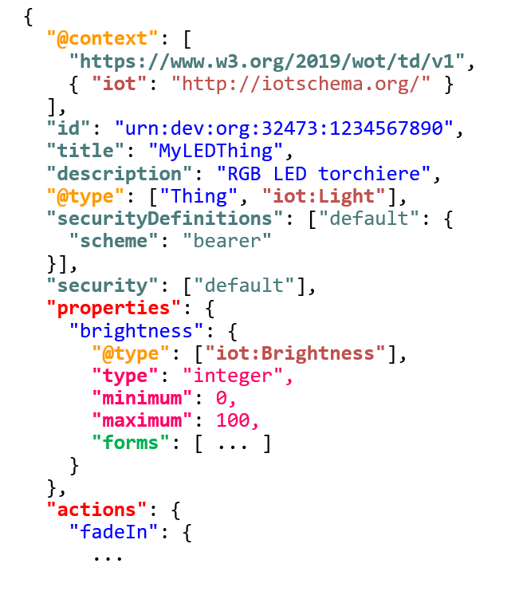
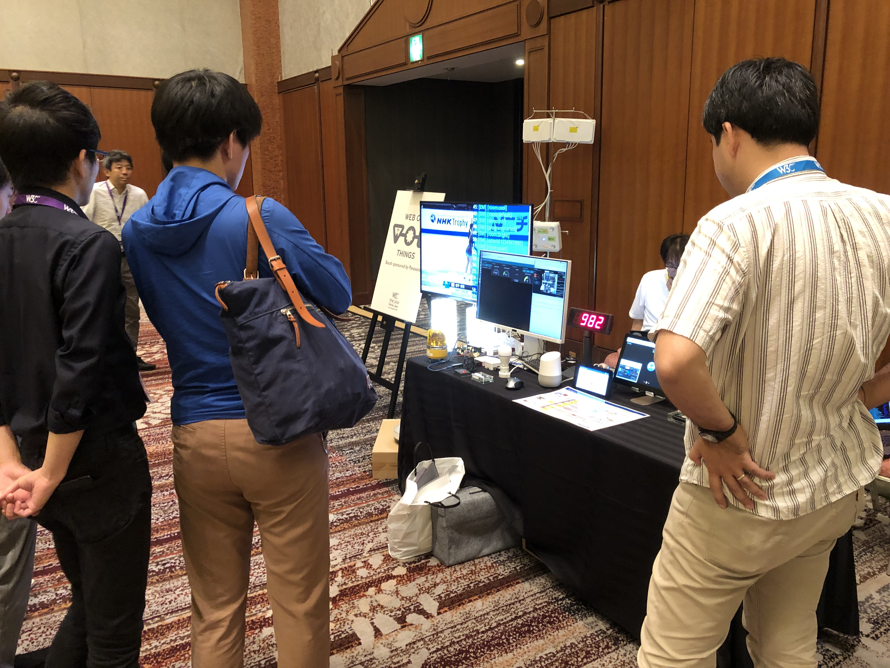
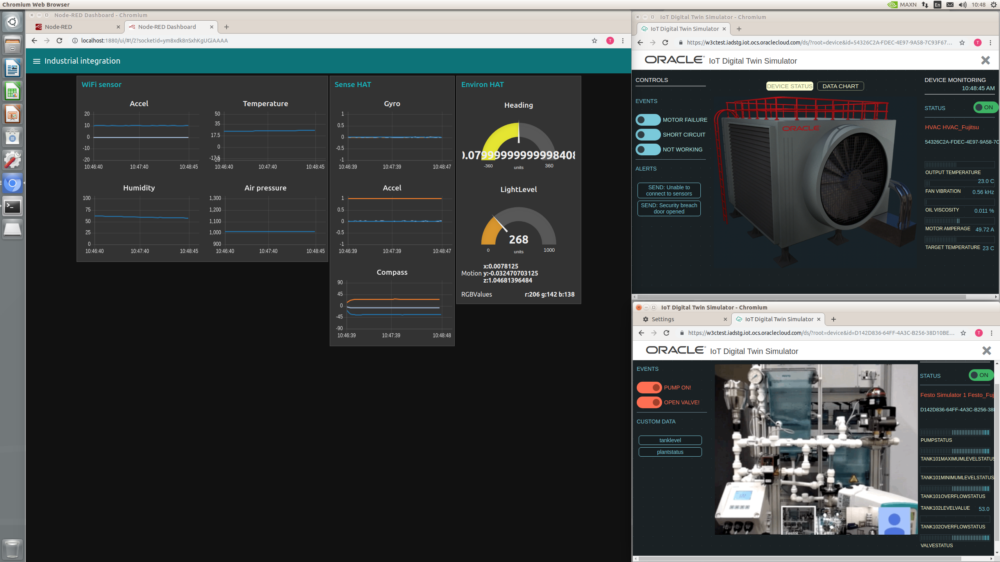
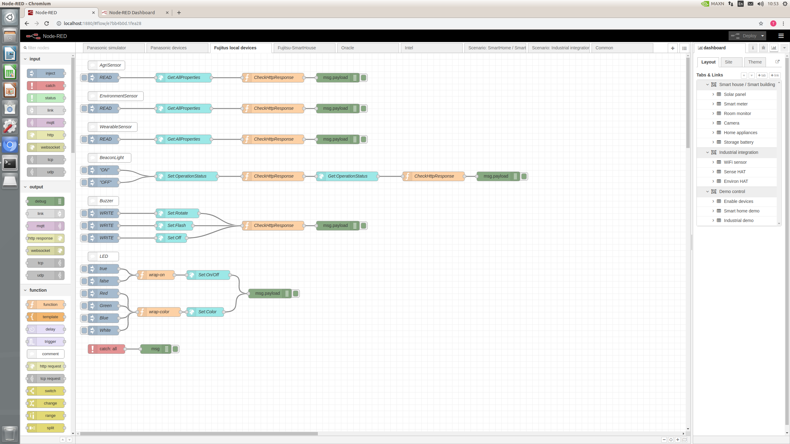
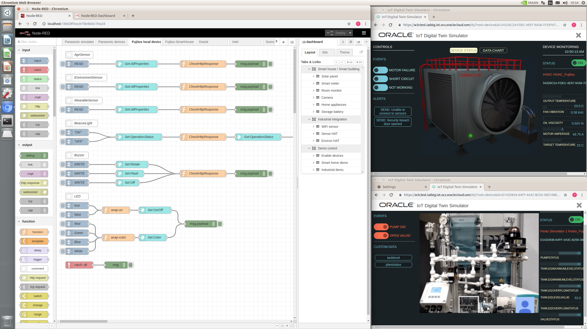
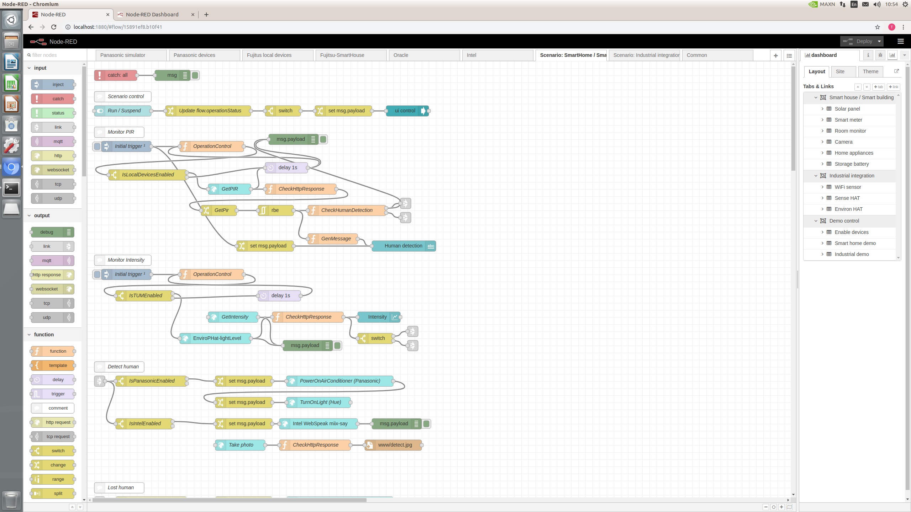

# Blog Post Images
Images suitable for use in posts.

## General
* <a href="wot-abstract-arch.png">WoT Abstract Architecture Diagram: </img></a>
* <a href="example-TD.png">Example TD: </img></a>

## From WoT Workshop, Munich June 2019
* <a href="DSC_3147.jpg">DSC_3147: </img></a>
* <a href="DSC_3150.jpg">DSC_3150: </img></a>
* <a href="DSC_3154.jpg">DSC_3154: </img></a>
* <a href="DSC_3266.jpg">DSC_3266: </img></a>

## From TPAC, Fukuoka Sept 2019
* <a href="tpac-demos.jpg">TPAC Demos: </img></a>
* <a href="IMG_1676.jpg">IMG_1676: </img></a>
* <a href="IMG_1677.jpg">IMG_1677: </img></a>
* <a href="IMG_1681.jpg">IMG_1681: </img></a>
* <a href="scenario_nhk.png">NHK Hybridcast scenario: </img></a>
* <a href="screenshot.png">Siemens e-car charging scenario: </img></a>
* <a href="test_scenario_1.png">Interoperability testing, scenario 1: </img></a>
* <a href="test_scenario_2.png">Interoperability testing, scenario 2: </img></a>
* <a href="Screenshot_from_2019-09-18_10-48-47.png">Screenshot_from_2019-09-18_10-48-47.png: </img></a>
* <a href="Screenshot_from_2019-09-18_10-53-44.png">Screenshot_from_2019-09-18_10-53-44.png: </img></a>
* <a href="Screenshot_from_2019-09-18_10-54-02.png">Screenshot_from_2019-09-18_10-54-02.png: </img></a>
* <a href="Screenshot_from_2019-09-18_10-54-18.png">Screenshot_from_2019-09-18_10-54-18.png: </img></a>
* <a href="Screenshot_from_2019-09-18_10-54-30.png">Screenshot_from_2019-09-18_10-54-30.png: </img></a>
