# Notes for Explainer Video Script

Here are the [original storyboard slides](https://github.com/w3c/wot-marketing/blob/master/material/wot_explainer_script.pdf),
screenshots of which are shown below.  However, the images in the storyboard are only meant to be suggestive, and the text may
not match the current script, below.

The original text had some issues so some revised text is suggested below in "Alt" sub-bullets.

* Oracle Comments:
Several key messages should be emphasized:
- Integration of multiple devices from different manufacturers without on-device development
- Leveraging 3rd party work, i.e. TDs for existing devices (cerated by him, or some open source activities)
- (In the future) getting TDs from device manufacturers
- Using an existing open source X-protocol reference implementation
- Devices should be professional, i.e. no hobby-like Raspberry stuff, rather industry grade sensors, ...
- Use case should be elaborated and diversified, i.e. not only more" but also "better", "easier", "reduce energy consumption and waste". Also be to increase quality, e.g. by determining the exact  time for harvesting, optimizing the use of his harvesting equipment, wine press, quality assurance and predictions

## Scene 1
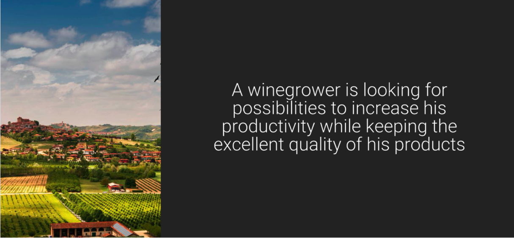
* Spoken: 
   - A winegrower is looking for possibilities to increase (his) productivity while keeping the excellent quality of (his) products
       - Alt (OK): A winemaker is looking for ways to increase productivity while keeping excellent product quality.
* Staging: Far-away view of vineyard (maybe animation that zooms in from clouds...)
* Comments: 
   - Should gender-specific "his" be changed to gender-neutral "their" or perhaps to "her"?
     We could also use "the winegrower" etc, use plural "developers" (and "their" instead of "he"), etc.
     To highlight this issue I have put all gender-specific names and pronouns in parenthesis,
     and suggested some alternative text that avoids the issue.
   - Is "winegrower" standard usage in English?
     Or is "winemaker" better?
     Later slides use "winemaker" and I think it's better.
   - There are also multiple people (winegrower/winemaker, consultant/developer) - these could be different genders.
   - Later text also uses both "developer" and "consultant"; maybe we should pick one?
     This stakeholder name inconsistency issue applies to the entire text.
   - The original draft script had a female winegrower.  What happened?
   - There is also the issue of race.
     While it would be relatively easy to balance genders by having one male and one females since we have two stakeholders,
     race is not so easy since there are only two,
     and assigning specific races may have a polarizing effect instead.
     Also racial mixes are different in different parts of the world,
     so a combination that makes sense in the US may just be odd in Singapore, and vice-versa.
   - We could avoid the whole bias issue by using non-gender-and-race specific animal characters (eg cat and rabbits...).

## Scene 2a
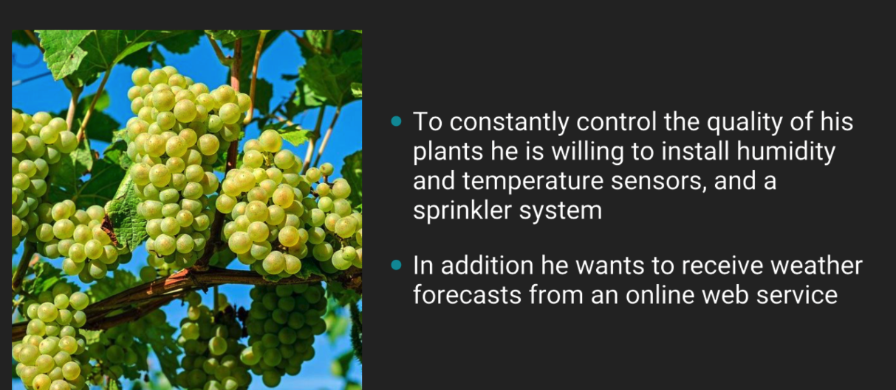
* Spoken:
   - To constantly control the quality of (his) plants (he) is willing to install humidity and temperature sensors, and a sprinkler system.
       - Alt (OK): To better control quality, the winemaker is willing to install humidity and temperature sensors, and a sprinkler system.
* Staging: 
   - Keep zooming in, stop on a closeup of some grapes on the vine
   - Show addition of sensors and sprinkler system
   
## Scene 2b
* Spoken:
   - In addition (he) wants to to receive weather forecasts from an online web service
       - Alt (OK): Weather forecast data from an online web service would also be useful in order to predict water requirements.
* Staging: 
   - Show data coming from cloud
   - Since it's weather data, can be from an actual cloud...
   - Data can be 0's and 1's falling as rain...
   
Comment: 
   - Maybe "Weather" should be "Rain" to be more specific and match the visual?
   
Oracle Comment:
   - The user scenario should be explained more with different variants in increasing complexity, e.g. initially only monitoring of soil and weather conditions, a dashboard, alerting. Later on he installs an irrigation system, has active control based on measurements.

## Scene 3
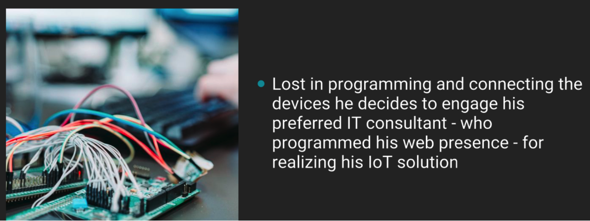
* Spoken: 
   - Lost in programming and connecting the devices (he) decides to engage (his) preferred IT consultant - who programmed (his) web presence - for realizing (his) IoT solution
       - Alt (we will skip this scene): After quickly getting lost programming and connecting devices, the winemaker decides to engage an IT consultant.
       - Second half moved to voice-over of Scene 4, which shows a search for an IT consultant.
* Staging: 
    - Show a "development system" that explodes in complexity
    - Winemaker has an idea (maybe a thought bubble) of asking the consultant that was used for the web presence for help with IoT
* Comments: 
   - Image in original shows a messy breadboard, but a more "professional" picture that relates to software (perhaps a circle-and-line graph that explodes in complexity) would be better.
   - Spoken text is quite long and complex (may confuse non-native English speakers).
   - I have suggested alt text that breaks it up a bit (and is also gender neutral).
   
* Oracle Comments: I don't think a wine grower has leisure time to learn programming, install, set up and configure devices, ... at all. It is not realistic that he even thinks about developing sth. by himeself, he's looking for a turnkey solution.
   - 
   
## Scene 4
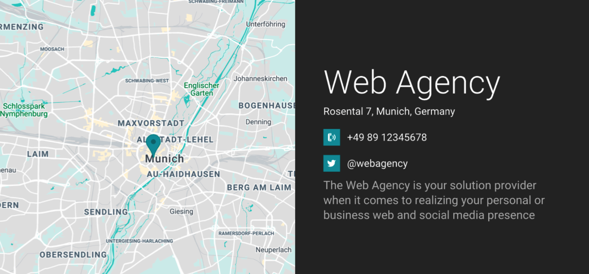
* Spoken:
   - Alt (OK, but needs revision): The winemaker decides to engage an IT consultant. The winemaker would like to use the consultant who programmed the winemaker's web presence to realize an IoT solution.
* Text (it and the map should be "built" as the result of a simulated online search):
   - Web Agency
   - Rosental 7, Munich, Germany
   - phone: +49 89 12345678
   - twitter: @webagency
   - The Web Agency is your solution provider when it comes to realizing your (personal or business) web and social media presence
       - Alt (OK): The Web Agency provides solutions for your web and social media presence
* Staging: "Build" the result of an online search for a web solution provider
* Comments: 
   - Suggest deleting "personal and business", "personal" is weird, and phrase does not add value; put in paras above
   - I know it's an add for the agency, but it should be simplified; maybe could even be simplified futher; see Alt
   
* Oracle comments: Not sure that a Web developer is the right choice for this kind of integration.

## Scene 5
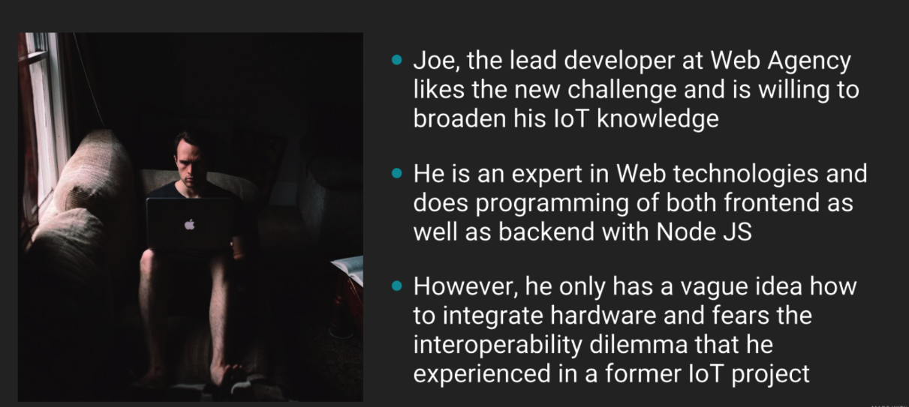
* Spoken:
    - (Joe), the lead developer at Web Agency likes the new challenge and is willing to broaden (his) IoT knowledge
         - Alt (OK): The developers at Web Agency like the new challenge and are willing to broaden their IoT knowledge
    - (He) is an expert in Web technologies and does programming of both frontend as well as backend with Node JS
         - Alt (OK): They are experts in both web frontend and backend technologies using Node JS
    - However, (he) only has a vague idea how to integrate hardware and fears the interoperability dilemma that he experienced in a former IoT project
         - Alt (OK): However, they are worried about the interoperability problems that they experienced in a former IoT project.
* Staging:
    - Show picture of a developer hacking away, scratching his/her/their head, shuddering a little at some bad memories of a past project (maybe a thought bubble showing the consultant vainly trying to plug together two incompatible connectors)
* Comment
    - "Joe" is another male... consider mixing it up a little, at least.
      For example, make winemaker female if developer is male, or vice-versa, or make them both gender-neutral.
    - Also, we should avoid making all the characters white...
    - If we want to make the developer gender neutral, to avoid making "their" weird,
      we could just have multiple developers (The lead developer -> The developers)
    - I'm not sure the "vague idea" text is needed.  Either they have experience, or they don't.
      The second sentence implies they have experience, but know it's hard.
      I think we should use only the second sentence.
    - I also broke up the second long sentence into two shorter sentences.
    
* Oracle Comments:
   - What are the pain points to IoT? Interoperability? Compatibility? Why is Web of Things making it easier to integrate IoT devices? What does the developer actually develop? A device? A gateway? A cloud application?
    
## Scene 6
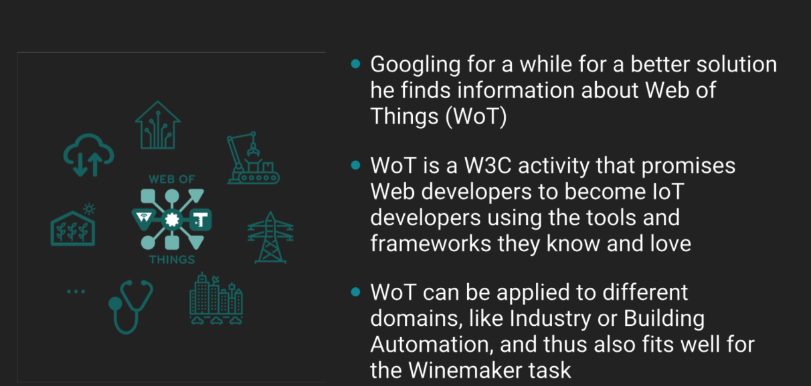
* Spoken: 
    - Googling for a while for a better solution (he -> the consultant) finds information about the Web of Things (WoT)
         - Alt (OK): After searching online for a solution, the developers find information on the Web of Things, also known as Double-U-oh-Tee: "WoT".
    - WoT is a W3C activity that (promises -> enables) Web developers to become IoT developers using the tools and frameworks they love
         - Alt (OK): WoT is a W3C activity that enables Web developers to become IoT developers using the tools and frameworks they love.
    - WoT can be applied to different domains, (like -> such) as Industry or Building Automation
         - Alt: WoT can be applied to many different IoT domains,
           such as Manufacturing or Building Automation,
           but is also applicable to the winemaker's problem in Agriculture.
* Staging (Updates that there should be two scenes):
    - Google search, typing in "IoT interoperability solution using web technology" -> some results pop up (represented as icons and logos)
    - WoT logo popping up should co-incide with narration speaking "WoT"
    - Other logos (JS, etc) should pop up with the phrase "tools and frameworks they love"
    - example logos: HTML, JSON, JS/TS, node-red, angular, RDF, react, Vue,...
    - animated domains: Smart home, manufactor, smart grid, smart city, healthcare, agriculture, cloud systems... 
    
* Comments:
    - Is a search, so let's state the problem in the search text...
    - "Promises" is weird English.  "Allows" or "Enables" would be more natural.
    - Also "like" is also more natural as "such"; changed above.
    - When spoken, introduction of the WoT acronym needs to be explicit.
    - Last phrase needs to emphasize is applicable to winemaker's problem.
    - Also changed "Industry" to "Manufacturing" to be more concrete; "Industry" is too broad.
    - Also got rid of "Googling": we should avoid a specific company name.  Changed to "searching online"
    
* Oracle comments: 
- Perhaps we can find a better "discovery of WoT" story than "he googles and stumbles over WoT", such as for some of the devices he gets thing descriptions that describe the device interfaces in a common way.
- If the benefits are finding a Node.js based reference implementation there's no difference / advantage of WoT to other open IoT software projects. Why should he use a W3C standard?
- I believe one answer we should provide is that he can save a lot of time for the integration of "off-the-shelf" devices that are compliant to the standard. I.e. Use TDs that are provided by manufacturers / 3rd parties and have low integration efforts. For many brown field devices he can obtain/write TDs and use a common framework (node-WoT) for integration without significant coding of protocol adapters (assuming node-WoT supports the protocol(s).)
    
## Scene 7
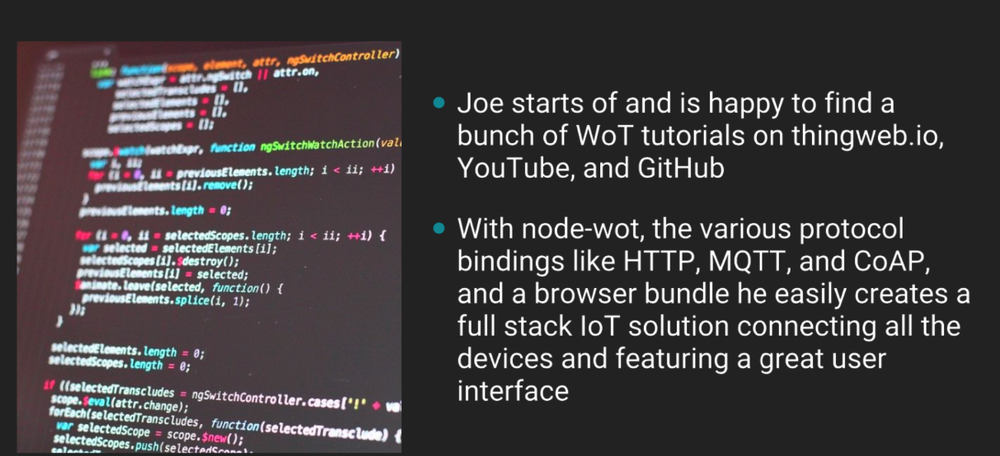
* Spoken:
    - ((Joe) starts off and -> The consultant) is happy to find a bunch of WoT tutorials on thingweb.io, YouTube, and GitHub
        - Alt: The developers are happy to find a bunch of WoT tutorials on thingweb.io, YouTube, and GitHub.
    - With node-wot, the various protocol bindings like HTTP, MQTT, and CoAP, and browser bundle (he -> the consultant) easily creates a full stack IoT solution that connects all the devices and features a great user interface
       - Alt: With node-wot, various protocol bindings like HTTP, MQTT, and CoAP, and a browser bundle, the developers easily create a full stack IoT solution.
         This solution connects all the devices and features a great user interface.
* Staging:
    - Show code rapidly being built, user interface popping up
    - User interface mock-up should have a set of icons for watering (water drop) and weather sensing functions (sun, rain, etc) on a web page, and a map of the vineyard.
    - Maybe a representation of "tutorials" should also flow down the right side of the screen (representation of videos, documents, etc)
* Comments:
    - Small fixes to original text included ("starts of" changed to "starts off", "connecting" to "that connects", etc).
    - We should provide some real code for the animator to use in a "build"
    - Simplified text by getting rid of "that" relative pronoun (confusing to non-native speakers...).  
      Breaking up the sentence also makes the timing easier for popping up a "user interface"
    - Should we also mention Node-RED?
    
## Scene 8
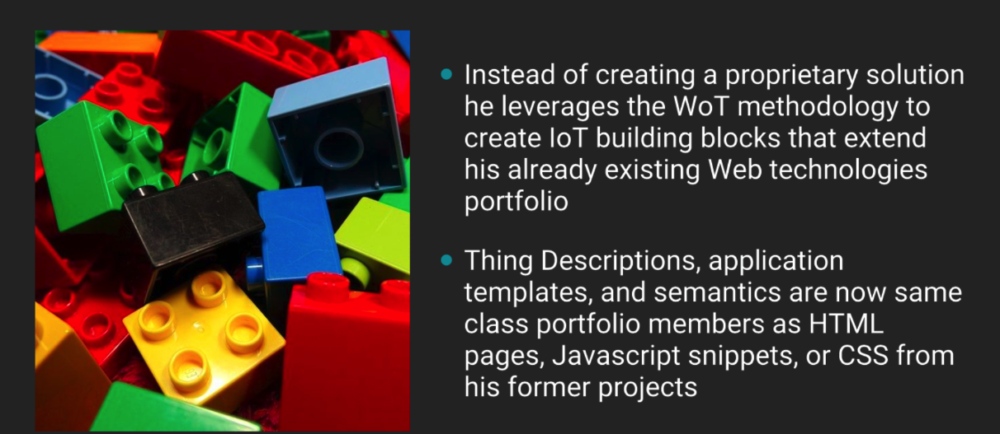
* Spoken:
    - Instead of creating a proprietary solution (he) leverages the WoT methodology to create IoT building blocks that extend (his) already existing Web technologies portfolio
       - Alt: Instead of creating a proprietary solution, the developers use the WoT methodology to create IoT building blocks.
       - Alt: These building blocks extend their existing Web technologies portfolio.
    - Thing Descriptions, application templates, and semantics are now same class portfolio members as HTML pages, Javascript snippets, or CSS from his former projects
       - Alt: Thing Descriptions, WoT application templates, and IoT semantics are now in the same portfolio of reusable modules as
         HTML pages, Javascript packages, or CSS from former projects
* Staging: 
    - Show a structure being built from a collection of blocks
    - Intel is not allowed to use the word "leverage" in communication...
    - "Already" is redundant
    - Breaking up into shorter sentences, fixing gender issues
    
* Oracle Comments:
- Motivate for why a standardised solution. Reuse of existing parts for future projects, faster integration, out of the box adaptation to future devices, ...
    
## Scene 9
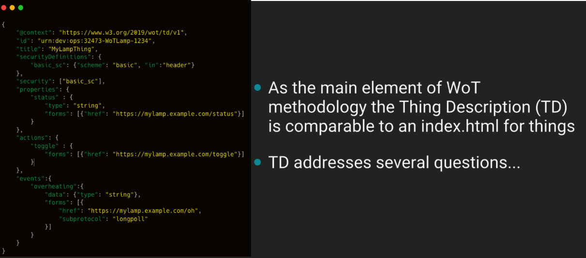
* Spoken:
    - As the main element of the WoT methodology the Thing Description is comparable to an index.html for Things
        - Alt: The main element of the WoT methodology is the Thing Description, also known as a Tee-Dee.
        - Alt: The TD is comparable to an index.html for Things
    - WoT TDs addresses several questions... 
        - Alt: (nothing; in next scene)
* Staging: 
    - Show a thing (perhaps a sprinkler or sensor from the opening)
    - Show a "tag" attached to it (perhaps with a WoT TD logo, which we should provide)
    - Open tag, zoom in, see JSON of TD (which we should provide...)
* Comment: 
    - existing picture not that great, final step of zoom
    - The TD acronym needs to be explicitly introduced, maybe also include "WoT TD" in text superimposed on top of the screen, along with the TD logo
    - Last bit of text can be removed, overlaps with the voice-over in the next scene

## Scene 10
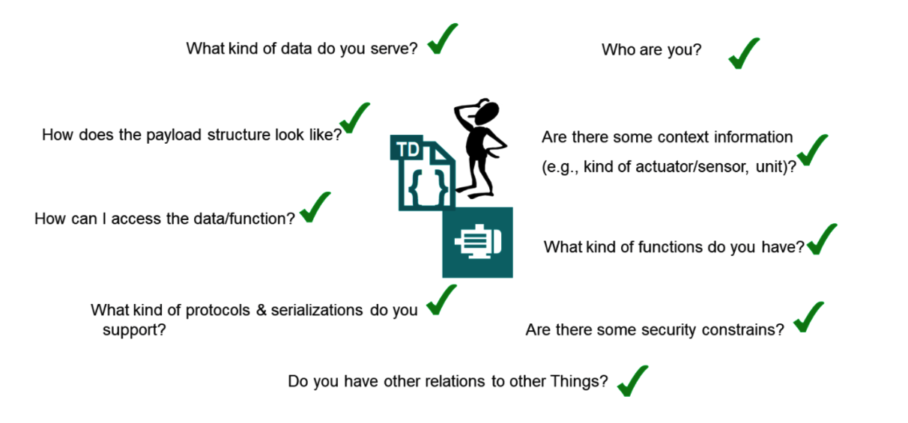
* Spoken: Various questions can be answered by the information in the TD
* Text: (various questions pop up sequentially in a circular array around WoT TD logo; do not need to be spoken)
    Questions (written only):
    - What kind of data do you serve? X
    - Who are you? (Identification) 
    - How does the payload structure look like? (Payload structure)
    - How can I access the data or function? (Data access)  (Function invocation) X
    - What kinds of products and serializations do you support?  (Serialization support) X
    - Is there context I need to understand, such as units, or the various kinds of sensors?  (Units)  (Sensor types)
    - What kinds of functions to you have?  (Available interactions)
    - Are there some security constraints?  (Security constraints)
    - Do you have relationships to other Things?  (Relationships to other Things)
    FEEDBACK (Ege): simplify: eg "Payload structure"
* Staging: 
    - Developer has a thought bubble, zoom into it to set stage...
    - Questions should show up one by one, get "checked off"
* Comments: 
    - to save time, suggest NOT reading out the questions individually
    - The "context" question is a little vague, I suggest replacing it with a couple more concrete questions: what units do you use, are you an instance of a class of devices.  It could perhaps be replaced with more concrete questions ("What kinds of units are values in?" etc)
    - small English fixes
    
## Scene 11
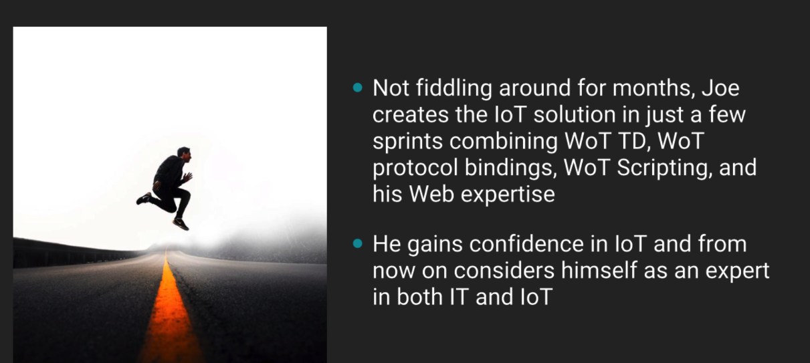
* Spoken:
    - Not fiddling around for months, (Joe) creates the IoT solution in just a few sprints combining WoT TD, WoT protocol bindings, WoT scripting, and his web expertise
         - Alt (OK): Instead of fiddling around for months,
           the developers create the IoT solution in just a few sprints by combining WoT TDs,
           WoT protocol bindings, and WoT scripting with their web expertise.
    - (He) gains confidence in IoT and from now on considers (him)self as an expert in both IT and IoT 
         - Alt (OK): The developers gain confidence in IoT and from now on consider themselves experts in both Web and IoT technologies.
* Staging:
    - Imaging showing high-speed development, maybe playing off "sprint" (eg show developers running down a track)
* Comments:
    - Alternatives given have both gender-neutral language (using plurals) and fix some English issues
    
## Scene 12
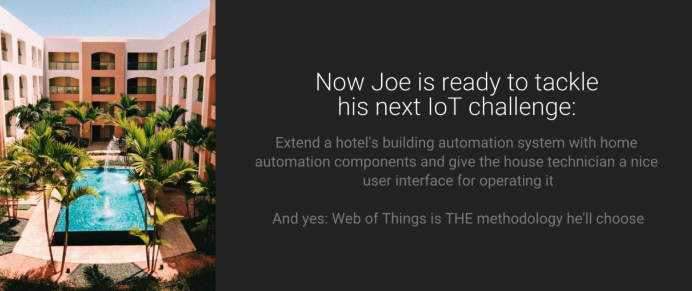
* Spoken:
    - spoken: Now Joe is ready to tackle his next IoT challenge
        - Alt (OK): Now the developers are ready to tackle their next IoT challenge.
* Text (on job posting): 
    - Extend a hotel's building automation system with home automation components and give the house technician a nice user interface for operating it
* Staging:
    - Show job board
    - Zoom in on a job posting with the above written text, picture of a hotel
    - Zoom to WoT logo when talk about methodology
    
## Scene 13
Spoken:
  - And yes, WoT is THE methodlogy they will use.
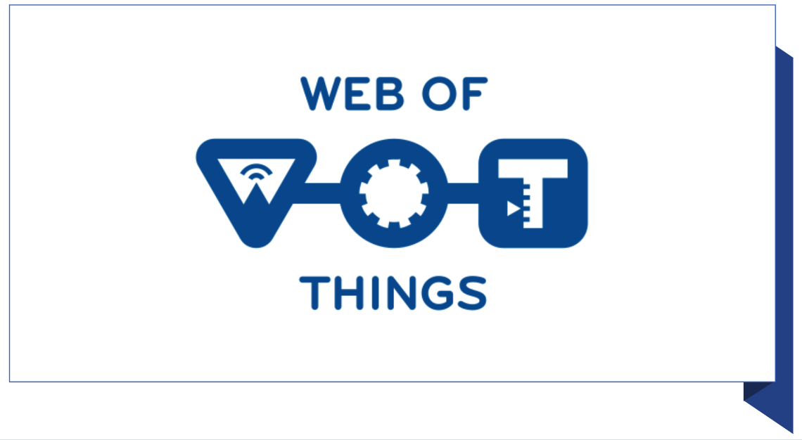
* Staging:
    - zoom into WoT logo, hold

   
